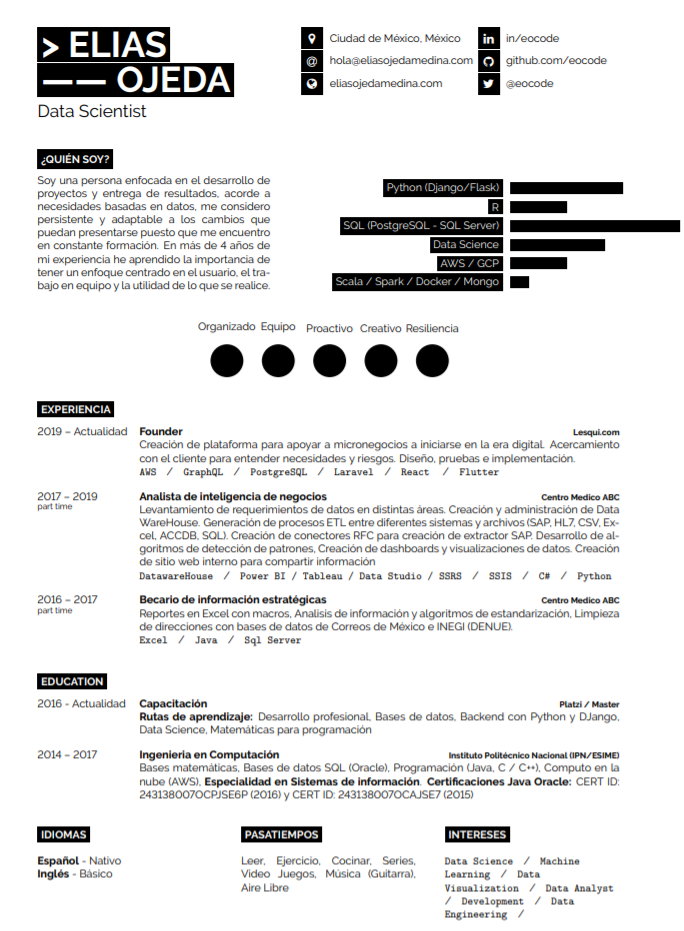

# :page_with_curl: Biografia y CV | eocode<!-- omit in toc -->

## Tabla de Contenido<!-- omit in toc -->
- [Biografía](#biografía)
  - [English](#english)
  - [Español](#español)
- [Mi CV](#mi-cv)

# Biografía

Biografía basada en: https://business.tutsplus.com/es/tutorials/how-to-write-a-short-bio--cms-30643

## English

Elias Ojeda Medina is a Software Engineer and DataScientist, with experience in building software with different languages, currently using Python as the main language, an active member of the Platzi Master program

He is a Computer Engineer from the Instituto Politécnico Nacional in Mexico City

In 2015 and 2016 he acquired two certifications in Oracle for technologies in the Java language, which contributed to having bases for the development of software

He has collaborated independently in the sectors: real estate, restaurant and retail in the development of computer solutions for certain processes and in the construction of web platforms, implementing recent technologies such as cloud computing, graphql and SPAs.

In recent years, he worked in data processing for the health sector, supporting data centralization processes, analysis and visualization of information for decision-making and improvement of both clinical and management and operation processes, working with implementations of Robust software with systems like SAP.

It has 2 active projects, activating ideas, a platform to share experiences, as well as knowledge in technology and Lesqui, a platform focused on retail trade.

He is constantly in continuous learning at Platzi and doing projects to practice what he has learned

Your hobbies are outdoor activities, exercise, reading, seeing new places, cooking, listening to music, and sometimes playing guitar.

To know more you can send an email to hola@eliasojedamedina.com or visit their website at eliasojedamedina.com

## Español

Elias Ojeda Medina es Ingeniero de Software y DataScientist, con experiencia en la construcción de software con diferentes lenguajes, actualmente usando Python como lenguaje principal, miembro activo del programa Platzi Master

Es Ingeniero en Computación por el Instituto Politécnico Nacional en la Ciudad de México

En 2015 y 2016 adquirió dos certificaciones en Oracle para tecnologías en el lenguaje Java, lo que contribuyo a tener bases para el desarrollo de software

Ha colaborado independientemente en los sectores: inmobiliario, restaurantero y retail en el desarrollo de soluciones informaticas para ciertos procesos y en la construcción de plataformas web, implementando tecnologías recientes cómo cloud computing, graphql y SPAs.

En los últimos años se desempeñó en el tratamiento de datos para el sector salud, apoyando en procesos de centralización de datos, análisis y visualización de información para la toma de decisiones y mejora de procesos tanto clínicos como de gestión y operación, trabajando con implementaciones de software robustas con sistemas como SAP.

Cuenta con 2 proyectos activos, activando ideas, una plataforma para compartir experiencias, así como conocimiento en tecnología y lesqui una plataforma enfocada al comercio al por menor

Se mantiene constantemente en aprendizaje continúo en Platzi y realizando proyectos para prácticar lo aprendido

Sus pasatiempos son las actividades al aire libre, el ejercicio, leer, conocer lugares, cosas nuevas, cocinar, escuchar música y algunas veces tocar guitarra

Para saber más puedes enviar un correo electronico a hola@eliasojedamedina.com o visitar su sitio web en eliasojedamedina.com

# Mi CV

CV personal escrito en LaTeX usando  [minimal latex cv template](https://github.com/janvorisek/minimal-latex-cv) desarrollado por: [@janvorisek](https://github.com/janvorisek)

Ver en PDF [aquí](/CV-Elias%20Ojeda%20Medina.pdf)

  

